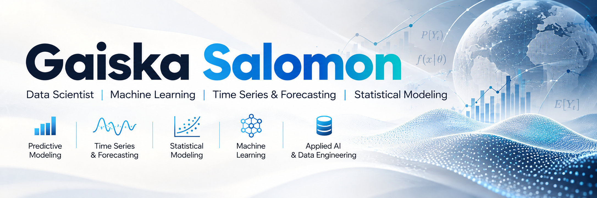

 

---

## About

Data Scientist and Ph.D. Candidate in Statistics & Data Science with experience in statistical modeling, machine learning, time-series forecasting, quantitative research, software development, and applied AI.

I build reproducible analytical workflows from data preparation and feature engineering to modeling, validation, evaluation, and technical delivery.

---

## Selected Work

### [nsevt](https://github.com/GaiskaSalomon/nsevt)
Production-stable Python package for non-stationary extreme-value inference.

`Python` · `Statistical Inference` · `Monte Carlo` · `Extreme Value Theory`

### [Climate Commodity Alpha Lab](https://github.com/GaiskaSalomon/climate-commodity-alpha-lab)
Climate-informed commodity forecasting with walk-forward validation, Bayesian modeling, and cost-aware backtesting.

`XGBoost` · `LightGBM` · `PyMC` · `Time Series`

### [AgroLLM-ES](https://github.com/GaiskaSalomon/agrollm-es)
Spanish domain LLM pipeline with QLoRA fine-tuning and RAG on PostgreSQL + pgvector.

`PyTorch` · `Hugging Face` · `QLoRA` · `RAG`

---

## Stack

---

## Open to Opportunities

**Data Science · Research Data Science · Applied Scientist · Machine Learning · Statistical Modeling · Time Series & Forecasting**

